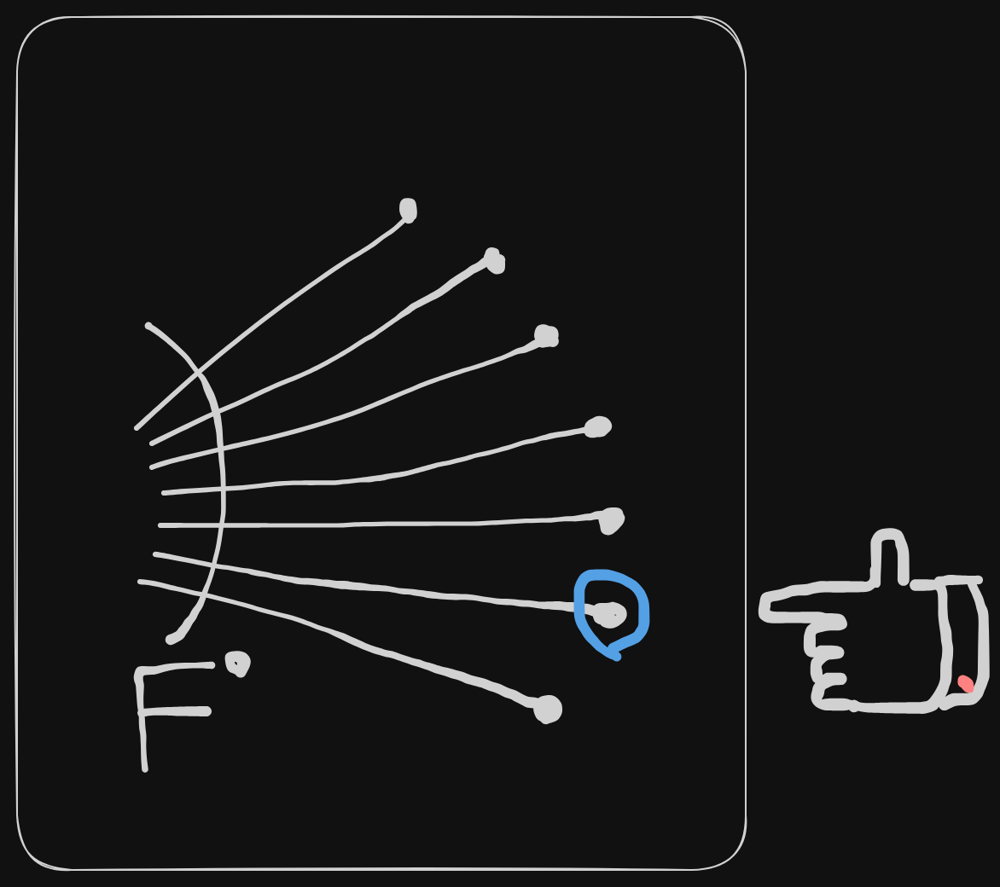
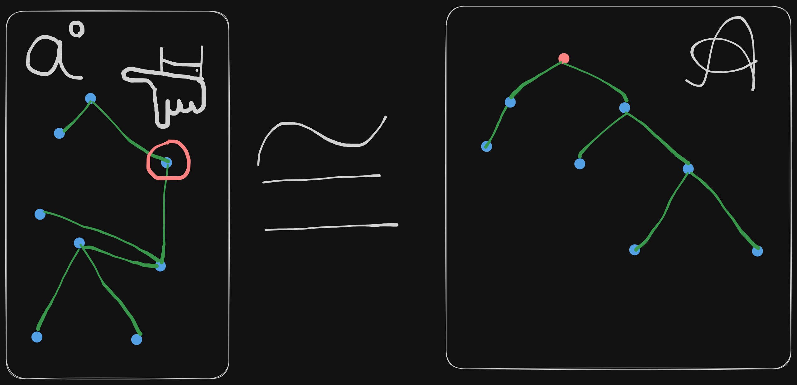
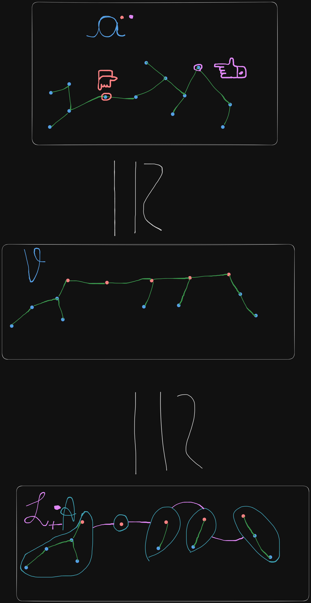

# Pointing and Cayley's theorem

Let $F: {Species of structures}$
$$F^{\circ} := F[U] \times U$$
Transport of structure is defined by:
$$\forall U, V \in \Omega, \forall \sigma: U \longrightarrow V \in \Gamma$$
$$F^{\circ}[\sigma](s, u) := \left(F[\sigma](s), \sigma(u)\right)$$

$$\text{Pointing to a structure}$$

## Example

$$\mathcal{A} = \mathcal{a}^{\circ}$$

$$F^{\circ} \cong X \cdot F^{\prime}$$
$$\implies \mathcal{V} := \mathcal{a}^{\circ\circ} \cong L_+(\mathcal{A})$$
$$|\mathcal{V}| = n^2|\mathcal{a}|$$
$$|\mathcal{V}| = |\mathcal{L_+(A)[n]}| = |\mathcal{S(A)}[n]| = n^n$$
$$\implies n^n = n^2 \cdot |\mathcal{a}|$$

## Properties

$$|F^{\circ}[n]| = n \cdot |F[n]|$$
