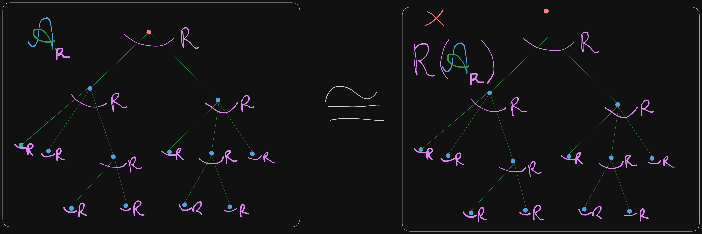

# R-enriched tree

Let $R$ be a species of structures, then an $R$-enriched tree structure on set $U$
consists of

1. A rooted tree $s \in \mathcal{A}[U]$
2. $\forall u \in U, R$-structure on the children of $u$

$$\mathcal{A}_r[U] := \text{Set of R-enriched tree structures on} U$$

## Example

$$\mathcal{A}_E = \mathcal{A}$$
$$\mathcal{A}_L = \text{Planar trees}$$
$$\mathcal{A}_{1 + X} = L_+$$
