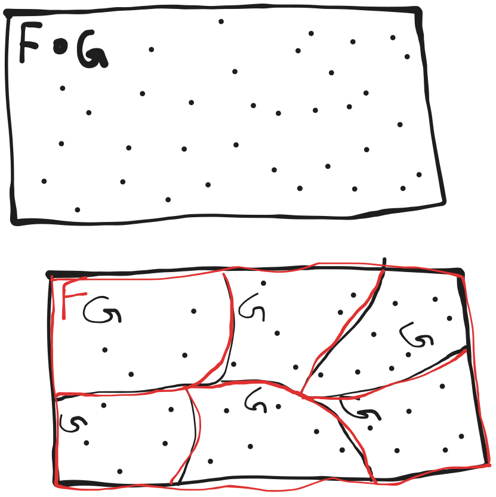
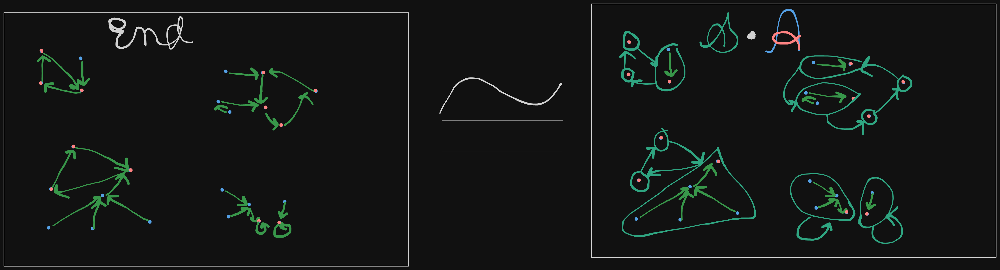

---
header-includes:
  - \usepackage {tikz}
  - \usetikzlibrary {positioning}
---
# Substitution of species

## Definition

Let, 
  $$F, G: \text{Combinatorial structure} \ni G[\emptyset] = \emptyset$$
$$\implies F \circ G = \sum_{\pi \in Par[U]} F[\pi] \times \prod{p \in \pi} G[p]$$
$$ = \left\{\left(\pi, \phi, \gamma\right) : \text{Par}[U] \times F[\pi] \times (\gamma_p)_{p \in \pi} \right\}$$

**$$\text{F}\circ\text{G}$$**

This is also called an $F$-assembly of $G$-structures.

## Example

$$\mathcal{End}[U] \subseteq \{F: U \longrightarrow U\}$$
$$\mathcal{End}[U] \cong \mathcal{S \circ A}$$

